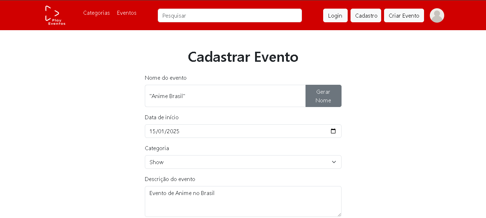

# Geração de nome com Inteligência Artificial

- No projeto foi adicionado a criação de nome do evento baseado na categoria e em uma descrição de evento.

- Foi utilizado API do GPT para essa funcionaliade.

- Você vai adicionar a Chave da API do GPT dentro do Arquivo addEvento.js na linha 146
  "Authorization": "Bearer SUA CHAVE API AQUI"

#  Como utilizar

- Existem 2 formas de voce testar

- Primeira com Node e segunda com Docker

# Com node:

- Voce vai abrir o projeto pelo vs code

- Dentro do vs code navegue até a pasta API e dentro de API vá até grupo 4

- Dentro de grupo 4 crie um .env com a seguinte linha

- MONGODB_URL=mongodb://localhost:27017/

- Você vai entrar no terminal do vscode e navegar até a pasta API e dentro de API vá até grupo 4

- Dentro da pasta API grupo 4, voce vai dar um npm install e logo após um npm start

- Em outro terminal você vai navegar até a pasta WEB e dentro de WEB vá até grupo 4

- Dentro da pasta WEB grupo 4, voce vai dar um npm install e logo após um npm start

- Feito isso estará rodando, para iniciar você vai no seu navegador e vai colocar localhost:8084

- No site você irá criar um cadastro e fazer o login

- Feito isso, você vai em Criar Eventro, vai selecionar uma Categoria e uma Descrição do Evento e vai clicar em GERAR NOME para gerar um nome para o Evento baseado nas informações que você colocou

# Com Docker

- Voce vai abrir o projeto pelo vs code

- Vai abrir o terminal e dar um $docker compose up -d

- Feito isso estará rodando, para iniciar você vai no seu navegador e vai colocar localhost:8084 ou localhost:8004
!
- No site você irá criar um cadastro e fazer o login

- Feito isso, você vai em Criar Eventro, vai selecionar uma Categoria e uma Descrição do Evento e vai clicar em GERAR NOME para gerar um nome para o Evento baseado nas informações que você colocou

